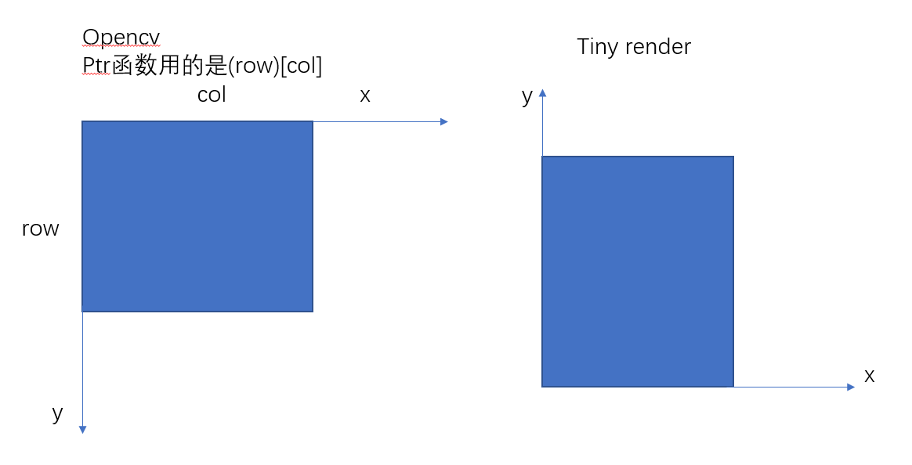
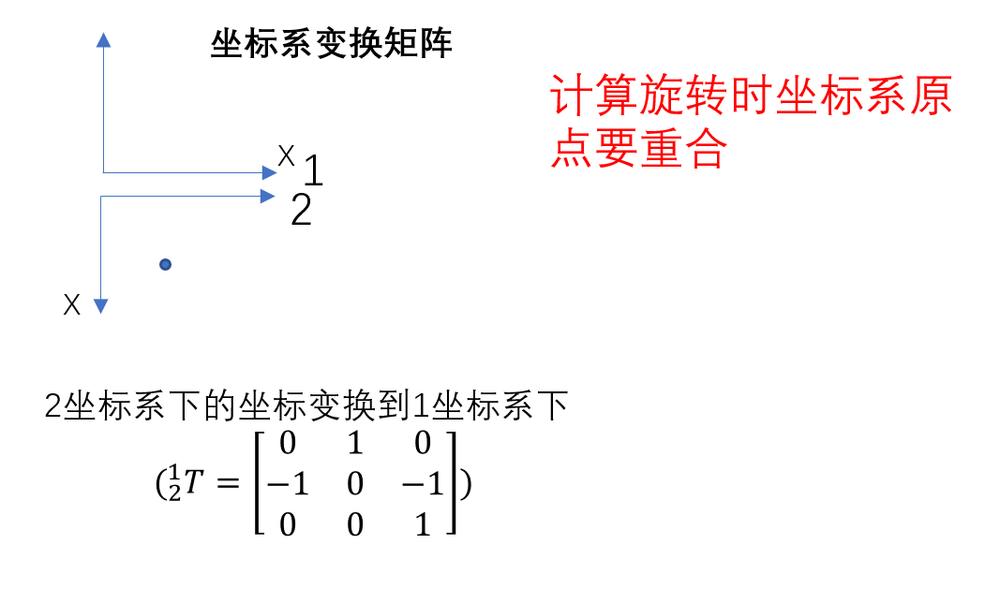
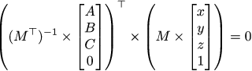
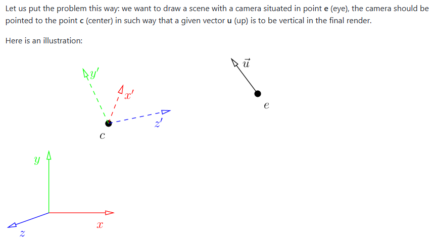
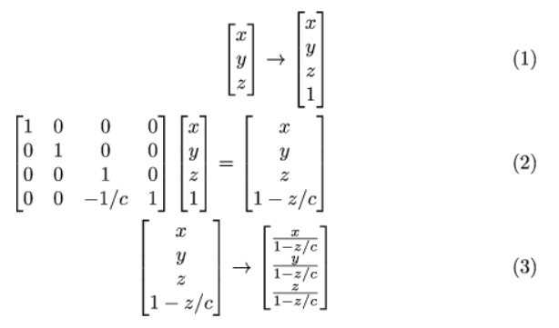

Tiny Render

对于 Ax+By+Cz=0.有法向量 n = (A,B,C)。放射变换(affine mapping)（如y轴变长两倍）Transformation of normal vectors：

# 画线

- Bresenham 直线算法：将点排列指向第一象限且斜率小于1，然后遍历x（较长）

# 画三角形

- 平顶平底法

- 重心法：找到包围盒，包围盒中重心为负值的不在三角形内或边上

# Z buffer

画三角形时，将当前z轴与z bufer 比较，近的就画并更新buffer ，远的就跳过

# lookat

# 透视投影

从相机 z 轴距离原点 c 处的透视投影，坐标做一下运算

# 移动相机/场景

相机不动，看向-z，up to Y。

